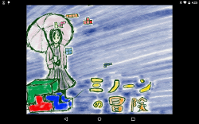

# Memo: 2d game math x physics (pre now making)

This Book write about 2dgame physics and math. I am making a 2d game library to get this knowledge now.

This Book follow these concept.

## Umiuni2D

Umiuni2D is 2D Game Library for writing this book.
http://kyorohiro.github.io/umiuni2d/web/demo/wonderminon/main.html
https://github.com/kyorohiro/doc_2dgame

#### Use Dart
Umiuni2D use flutter and Dart and WebGL as Develop Environment.

#### multiple-platform library
Umiuni2D's game is executable on android and iOS and modern browser.

## Index
* Math & Sprite
 * Velocity
 * Matrix
 * move
 * rotate
 * scale
 * inverse matrix and touch point
* 2D Physics
 * circle primitive
   * verocity
   * collision
   * rotate
   * grouping
  * other primitve
  * Cellular Automata
* Tech
 * texture atlass
 * algo
